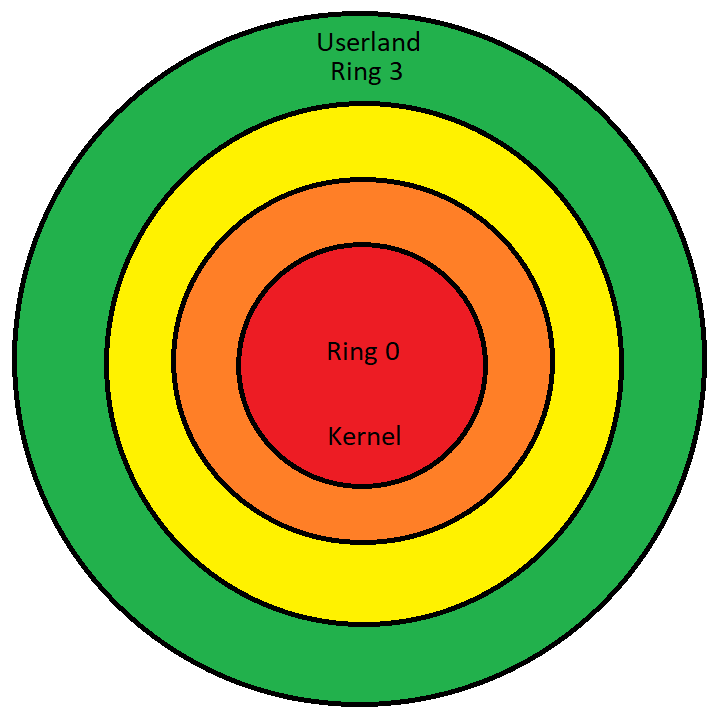

# 4. System calls
System calls are an important resource when building programs on userland, using such calls, we are able to interact with the Operating System, asking it to perform operations that only the kernel can accomplish. The most common requested operations from the OS include printing a string on screen, getting the current directory, reading a file and so on.

Keeping that in mind, a great part of the C language functions are performed by the Operating System, and not by the language itself. A program on userland doesn't have the privileges to access the Hard Disk to read a file or even access the network card to send network packets. Userland programs barely know how to perform such operations, the number of instructions generated by the compiler isn't enough to control an entire device, but is enough to instruct the OS to accomplish the necessary tasks.

A system call uses registers to communicate with the OS; also employing a new opcode called 'syscall'.

## 4.1. The relationship between userland and kernel mode
The modern CPUs are made with a built-in security mechanism called `rings`, such mechanism separates the code of the Operating System's kernel from the normal programs that are ran by the system users, such as the browser, games, text editors and so on.

These rings defines how much permissions a code being executed by the CPU has, inner rings have more permissions than the outer ones.



For the reason that only the kernel mode has complete access to the machine resources, many operations can only be performed by the kernel, so if a program on userland needs to write to a file on disk, it should ask the kernel to perform such operation.

An userland program can ask the kernel to perform a privileged operation by issuing a system call (also known as software interrupt), passing the correct parameters through the CPU registers, which will be useful to identify the system call and the values it will use to carry out such task.

At the moment the kernel is loaded on memory by the bootloader, it defines a `IDT` (interrupt descriptor table), used like a map by the processor when a program on userland issues a system call (software interrupt). An IDT contains the system call number and the function that the CPU needs to execute in kernel mode to accomplish the call, either written in C, as the Linux kernel does or any other capable programming language.

Once the kernel function that handles the requested system call has completed its execution, the execution flow returns to the restricted code on userland, downgrading the permissions again until the next system call.

## 4.2. Writing a program that prints Hello, world!

The code below is a program written in Assembly that prints the "Hello, world!" message:

```asm
; As mentioned before, the text segment is used to
; store the program instructions, so is within this 
; segment that we are going to write the Assembly code

; The global keyword is used to make
; a label available across all object
; files. The linker requires the
; main text label to be available using
; this keyword.
global _start

segment .text

; By default, the _start label is 
; the entry point of the program.
_start:

    ; The following block of 
    ; code will print a
    ; message on terminal.
    ;
    ; The rax register means the 
    ; operation to be performed, 
    ; the programmers that built
    ; the linux made the value 1
    ; represent "print something...".
    ;
    ; The rdi register is the file
    ; descriptor to where the print
    ; shall be redirected, '0' 
    ; represents the STDIN,'1' the
    ; STDOUT, and '2' the STDERR.
    ;
    ; The rsi register is the pointer to the 
    ; message.
    ;
    ; The rdx register is the message length

    mov rax, 1
    mov rdi, 1
    mov rsi, message
    mov rdx, message_size

    ; After setting the registers with the
    ; correct values, ask the OS to perform the
    ; task
    syscall

    ; Our program finished all its instructions,
    ; so we need to ask the OS to unload the
    ; program from memory    
    ;
    ; 60 is the exit syscall
    ; 0 is the exit status

    mov rax, 60
    mov rdi, 0

    ; Asking the OS to perform the task
    syscall

; The read-only data segment is the place
; where we define the 'Hello, world!' message.
segment .rodata

    ; We use 'db' to Define a Byte or a chain of bytes.
    ; Every comma outside the quotes is a 
    ; concatenation, so the value 0xa, that means '\n'
    ; is appended to the string.
    ;
    ; The 0x0 represents the null 
    ; character, that is always necessary when we
    ; are handling with strings

    message db 'Hello, world!', 0xa, 0x0

    ; 'equ $-' is useful to get the size of something on 
    ; memory, so message_size = sizeof(message)
    message_size equ $- message
```

At this moment, you might ask: "Is it really necessary to remember every single system call number when i need to use them to accomplish a task?". The answer is no. The Linux kernel developers already provide a list of all system calls, which can be found anywhere on the internet, but i would recommend this one: https://hackeradam.com/x86-64-linux-syscalls/.

## 4.3. Warnings

### 4.3.1. Registers after issuing a system call
When you issue a system call, a significant number of registers are wiped out, so you must save their values in memory if you want to use them later.

### 4.3.2. Getting the size of something on memory
The code `equ $-` is useful to get the size of something on memory; however, its functionalities are much beyond than just simply get the size.

The dollar sign (`$`) represents the current line at which the sign appears, so it is basically an arithmetic operation to find the size of something on memory, where the `$` is the minuend and the given address (`message` in this case) is the subtrahend. In other words, the size is found by the following formula:

`Size = CurrentAddress - BaseAddress`

Keeping it in mind, you will probably run into troubles if you do something like:

```asm
global _start

segment .text    
_start:
    mov rax, 1
    mov rdi, 1
    mov rsi, msg
    mov rdx, msg.sz
    syscall

segment .data
    msg db "Hello world!", 0xa
    msg2 db "Hello again and again", 0xa, 0x0
    msg.sz equ $-msg
```

`msg.sz` will have the size of `msg` and `msg2`, printing both messages when you were pretending to print only one.

## 4.4. Running the code

In order to run this code on your own machine, you will need the Nasm assembler. Although Nasm is available for other platforms, such as Windows, this code is designed to run exclusively on Linux systems due to the system calls being imcompatible on others platforms.

Assuming that your source file is called "hello_world.asm", use the following command to assemble:
```sh
nasm -f elf64 hello_world.asm
```
To link the object file, do:
```sh
ld hello_world.o -o hello_world
```
and simply call the program:
```sh
./hello_world
```

## 4.5. Customizing the entry point
As mentioned before in the comments of the previous example, the linker will use the _start label as the default program entry point. However, this is a customizable feature, and you can set the entry point to any label. The linker defines the entry point by the value provided to the `-e` flag.
```asm
segment .text
global customized_program_entry_point

customized_program_entry_point:
    mov rax, 1
    mov rdi, 1
    mov rsi, msg
    mov rdx, msg.sz
    syscall

    mov rax, 60
    mov rdi, 0
    syscall

segment .rodata
    msg db 'Hello, world!', 0xa, 0x0
    msg.sz equ $-msg
```
Commands to assemble and link the source file:
```sh
sh-5.1$ nasm -f elf64 entry_point.asm
sh-5.1$ ld -e customized_program_entry_point entry_point.o -o entry_point
```
Running the program should give us the expected result:
```txt
sh-5.1$ ./entry_point 
Hello, world!
```