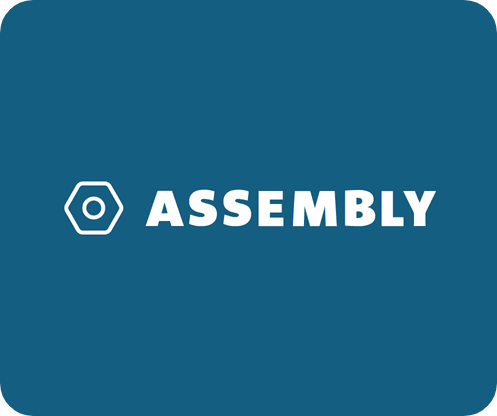

    <h1>Assembly Toolkit</h1>
    
    
Written by Cypher (Rômulo Peres de Moraes)

 

 

## What is this?
Assembly Toolkit is a compiled of knowledgments and ideas about the Assembly language, useful to learn the basics about this Low-level technology. This repository focus on the **Nasm** assembler, therefore, things from this repository may not work with another assembler.

## Repository sections
The contents of this repository is divided into topics about the Assembly language, each one has a number and its name on the source tree, the sections cover about opcodes, registers, memory segments, system calls, jumps, arithmetic operations, the stack segment, functions, arrays, macros, solutions, Useful opcodes, Assembly-C interoperability, PIC and Callbacks.

## Opcode section
Inside the opcode section we talk about the smallest part of a computer program, such part that when joined with other parts we have a complete program that can be run directly in the CPU of our computer.

## Registers section
Here we will cover in details what are registers and how they work. The register bank is a crucial component of the modern CPU designs, that make us able to manage data, make system calls, operate in memory segments and more...

## Segments section
The memory segments are a virtual division that every program running on a machine must have. The segments have their own roles, such as storing read-only data, storing uninitialized data, storing the program instructions and so on...

## System calls section
In this section we discuss about how our executables are lazy binaries that only know how to ask for their interests. Here we will cover in details the fact that: all interesting functionalies that a program may have is the Operating System that does everything.

## Jumps section
In the Jumps section we discuss about the one of the most important features that a computer has. Without jumps, function calls, loops and conditional statements could not be reality. 

The jumps section tells you about maybe the most important feature of a computer: do a jump. With jumps is possible to stop following a flow of instructions and start another flow in another region of the memory, beyond of course, make conditional structures like if/else, switch and loops, like for and while.

## Arithmetic section
The arithmetic section talks about how to do math using the smallest instructions that the CPU can read, math is very important for any program, and here is possible to see on to use the basic arithmetic operations, like add, subtract, multiply and division.

## Stack section
The stack section talks about the fixed amount of memory that every program receive at the moment that its life starts, this memory is useful to declare variables, make function calls, pass parameters and more, absorbing everything from this section makes the Assembly language begin to be funny to work.

## Functions section
The functions section tells you about how to create procedures and functions in the lowest level of the machine and how it works, learning how functions works in assembly allows you to understand how they even works on languages like C or another compiled language. Here will also be covered about how to pass and receive parameters from inside the function.

## Arrays section
The arrays section contains information of how to create and operate with arrays at the low-level, the necessary calculation to access an array index and the memory allocation is also covered in this section. Data structures are important, and the array is the most basic structure that we can have here.

## Macros section
The macros are a group of instructions that will take effect on the preprocessor of the assembler. With this is possible assign a value to a name, create blocks of codes and call them like a C function, conditional blocks of instructions and more...

## Solutions section
The solutions section is a compiled of assembly source files to Nasm assembler that copy functionalities of functions from the C programming language to give you a vision of how to build a little program with Assembly or even to use in larger programs. Examples of functions copied from C are: strlen(), strcmp(), atoi(), etc...

## Useful opcodes
This section is basically a list of opcodes that weren't covered during the entire path of the repository, however, they can make the difference while writing some bits.

## Assembly-C interoperability
Even being two different languages, Assembly and C can be joined to work together to accomplish a task, each one doing the best on its field.

## PIC
A Position Independent Code is useful because it doesn't depends of a fixed address on memory to reach a data or even jump to a procedure to do something. A Position Dependent software may cause some issues while being loaded into memory or even while being linked with a C program.

## Callbacks
Like in C, Javascript or Python, Assembly also supports a kind of callbacks that may be useful to make most flexible programs. With the feature of move a memory address to a register, this can be easily done by jumping to or calling this address.

## Assembly is psycho
I could lie and tell you that Assembly is an easy language and can be learned within a couple of days, but it's not the truth, therefore, if you found something wrong with any information in this repository, i encourage you to create an issue and report what is wrong, every help is appreciated.
